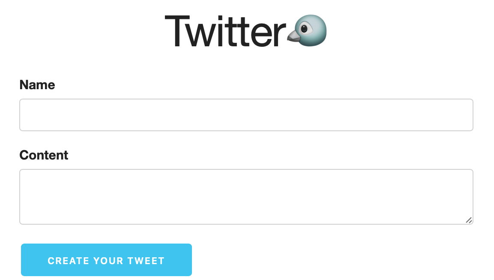

# twitter-clone-nodejs

Hi, I'm Diego and this is a project with two parts, the client part made with html, css and js and the other part is an API made with express.
Referencial Video: https://youtu.be/JnEH9tYLxLk.

# twitter-clone-nodejs-client

https://twitter-clone-nodejs-client.vercel.app/

[]

# twitter-clone-nodejs-api

If you want to use the API, you have to use the /news route.(It has a limit rate to post news)
https://twitter-clone-nodejs-api.vercel.app/
